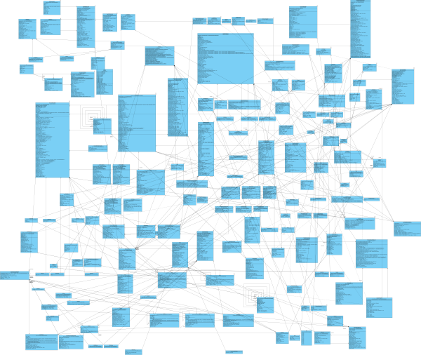
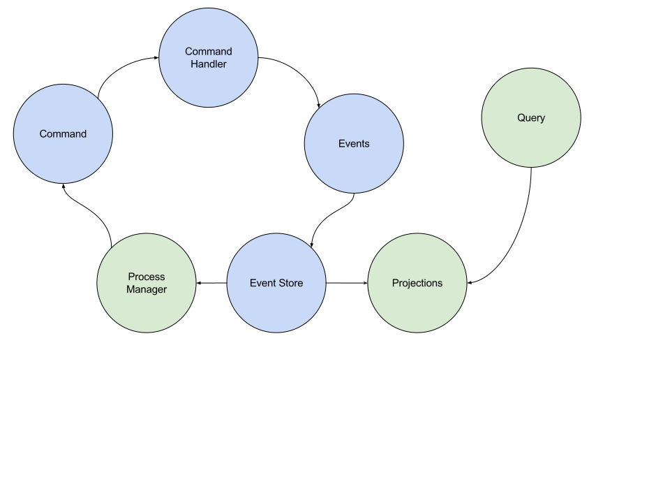

class: center, middle

# Intro to Event Sourcing and CQRS
### (And a little DDD)

???

# Exploring what ES/CQRS are and how they differ from traditional methods.

# Who has looked into either of these? Show of hands

# I'm going to tell you

---
class: center, middle

# Ben Moss
### Bitfield Consulting

[ben@bitfield.co](mailto:ben@bitfield.co)

[github.com/drteeth](https://github.com/drteeth)

[@benjamintmoss](https://twitter.com/benjamintmoss)

???

Hi I’m Ben Moss,
* I work as a consultant doing Ruby and Android work at moment at bitfield.co.
* I have my sights on Elixir for future work.
* I've done a lot of things in my past, including c# where a lot of these ideas originated.

---
class: center, middle, inverse

# Context: where are we now?

???

A brief overview of current practices, so we have something to contrast against when we get to the new stuff.

---
class: middle

# SQL & ACID transactions

Pro
* Easy
* Safe
* Well known
* Strong consistency

Con
* Locks and contention
* Doesn't scale that easily

???

# For most backend development,
# SQL is a solid bet, but it can start to fall down at scale

* Especially when we out-grow a single machine

* We scale by sharding & by replication
* Replication uses a log of events that followers tail
* Hang on to that idea.

---
class: middle

# 3rd normal form
* Provide a canonical source for data and relationships
* Re-combine those into the representations we need
* Often a single monolithic model supports all use cases

<!--  -->

???

# 3NF makes for a compact, duplicate free model, but it leaves a lot for readers to interpret and infer, usually at run time.

# When we need a different view of our data we need to re-constitute it from this 3rd normal form.

# We attempt to capture all representations and use cases in this single model and this can be the source of complexity. We also often end up with a lowest common denominator where our model struggles to meet all needs.

---
class: middle

# Indexing
* Speed up reads by creating alternative indexes behind the scenes
* Alternative structure written to disk that is optimized for particular read patterns
* Requires domain knowledge to write them
* Sacrifices write speed for read speed

???

# Indexing speeds up reads by keeping alternative lookups for specific read patterns. Comes at the cost of write speed.

* UI design informs which indexes are important
* Each index adds cost to write time so that strong consistency is always observed.
* Hang on to the idea of multiple, domain-informed representations

---
class: middle

# Descent into Dante's caching inferno
* One of the 2 hard problems in computer science
* Invalidating is complicated
* Adds a layer of complexity to the app
* Orthogonal to business concerns

???

# Caching is hard and is often used to make up for slow queries.

---
class: middle

# Searching
* Offloaded onto Solr/Elastic
* Outside of transaction boundary
* No joins allowed
* Eventually consistent.

???

# Searching is an example of another alternative representation, this time it's eventually consistent and can't participate in transactions.

* We turn to search engines to provide our user with the searching they expect.
* These live outside of the safety of our database transactions (yes, I know postgres can do it), and we often turn to application level callbacks to keep them in sync with our system of record (or database).
* It's also worth mentioning that if we want to join records with the main database, we have to do it at the application level.
* It's important to note that the sync is eventually consistent

---
class: middle

# Reporting & Analyics
* Batch model
* Often denormalized
* Eventual constiency

???

# Reporting is another example. It's often done in batch and denormalizes the data. Eventually consistent.

When stakeholders ask for reports, we either join the world in a 15 minute query that brings the server to it's knees or we periodically copy our database into an offline copy that we can work with.
Either way, we often spend 95% of the time and energy spent going over the same ground we covered last time.

---
class: middle

# Alternative/Specialized data storage
* Graph-friendly structures
* GIS
* 3rd party services (Salesforce, Accounting, etc)
* Often an all-or-nothing proposition

???

TODO: explain this better

Our investment in our general purpose databases often leads us away from syncing

# This is mostly about special use cases and how we often shoe-horn them into a SQL database rather than using a specialized tool. SQL has such a strong hold on our data that sharing it with another DB is untenable.

Similar to the Searching example, a graph or GIS database might be a better solution, but since the idea of syncing data to yet another database is unpaletteable, we often just force it on our SQL databases.

---
class: middle, center, inverse
# What are ES and CQRS then?

---
class: middle, center

# Event sourcing
##### Store events instead of state.
##### Rebuild state from events

???

# Instead of mutating the current state, keep a journal of changes from the initial state

---
class: middle, center

# Command-Query Responsibility Segregation

##### Separate Reads from Writes

???

# Do queries which return the current state

# Or perform an action that changes that state, not both at the same time

---
class: middle

# What is Event sourcing?
> "It’s just a left fold over the history of events!" -- Neckbeard McGee

???

# Okay...

---
class: middle

# What is Event sourcing?

```elixir
List.foldl(events, initial_state, fn (e, state) ->
  apply_event(e, to: state)
end)
```

???

# Greg Young. Reductionist, smart but kind of a dick.
# Belies the complexity and pitfalls.

---
class: middle

# What is Event sourcing?

Thanks for nothing.

---
class: middle

# What is Event sourcing?

> "Accountants don’t use pencils, they use pens." -- Neckbeard McGee

---

class: middle

# What is Event sourcing?

Events are immutable

Generate compensating ones to correct mistakes

???

# Simlar to accounting ledgers, events never change.
# New facts are added the replace older ones.

---
class: middle

# Quick example 1: Shopping cart

```elixir
%AddedToCart{ item: "apples" }        # ["apples"]
%AddedToCart{ item: "pears" }         # ["apples", "pears"]
%AddedToCart{ item: "pretzels" }      # ["apples, "pears", "pretzels"]
%RemovedFromCart{ item: "pretzels" }  # ["apples", "pears"]
%CartCheckout{}                       # []
```

do more slides like this - go a bit slower
event1 | current state
event2         v
event3         v
event4         v

Show this as the central idea
then talk about projections piggy-backing on those same events
In the same way that tracking the events for 1 model allows us to build up it's current state,
We can also combine the events for several models to derive new information. We call these projections as they project streams of events into new states.

Show an example of events projecting the aggregate state, and 1 or maybe 2 projects (list and detail?)

Walk the evenst through, showing the model changes again.
But this time, show that we're subscribbing a projection to the events
Talk about how querying the event store would be slow and painful.

---

```elixir
%PostSubmitted{ id: 1, body: "Semicolons considered dangerous" }

# Post models:
%Post{ id: 1, body: "Semicolons considered dangerous", status: "normal" }

# /posts
[
  %{ id: 1, body: "Semicolons considered dangerous", comment_count: 0 },
]

# /posts/1
%{
  body: "Semicolons considered dangerous",
  comments: [
  ]
}
```
---

```elixir
%PostSubmitted{ id: 1, body: "Semicolons considered dangerous" }
%Comment{ post_id: 1, body: "Well actually..." }

# Post models:
%Post{ id: 1, body: "Semicolons considered dangerous", status: "normal" }

# /posts
[
  %{ id: 1, body: "Semicolons considered dangerous", comment_count: 1 }, # <--
]

# /posts/1
%{
  body: "Semicolons considered dangerous",
  comments: [
    "Well actually...", # <--
  ]
}
```
---

```elixir
%PostSubmitted{ id: 1, body: "Semicolons considered dangerous" }
%Comment{ post_id: 1, body: "Well actually..." }
%Comment{ post_id: 1, body: "Did you even read the post?" }

# Post models:
%Post{ id: 1, body: "Semicolons considered dangerous", status: "normal" }

# /posts
[
  %{ id: 1, body: "Semicolons considered dangerous", comment_count: 2 }, # <--
]

# /posts/1
%{
  body: "Semicolons considered dangerous",
  comments: [
    "Well actually...",
    "Did you even read the post?", # <--
  ]
}
```
---

```elixir
%PostSubmitted{ id: 1, body: "Semicolons considered dangerous" }
%Comment{ post_id: 1, body: "Well actually..." }
%Comment{ post_id: 1, body: "Did you even read the post?" }
%PostSubmitted{ id: body: "Pretzels are delishious" }

# Post models:
%Post{ id: 1, body: "Semicolons considered dangerous", status: "normal" }
%Post{ id: 2, body: "Pretzels are delishious", status: "normal" } # <--

# /posts
[
  %{ id: 1, body: "Semicolons considered dangerous", comment_count: 2 },
  %{ id: 2, body: "Pretzels considered dangerous", comment_count: 0}, # <--
]

# /posts/1
%{
  body: "Semicolons considered dangerous",
  comments: [
    "Well actually...",
    "Did you even read the post?",
  ]
}
```
---

```elixir
%PostSubmitted{ id: 1, body: "Semicolons considered dangerous" }
%Comment{ post_id: 1, body: "Well actually..." }
%Comment{ post_id: 1, body: "Did you even read the post?" }
%PostSubmitted{ id: body: "Pretzels are delishious" }
%Comment{ post_id: 2, body: "Just no." }

# Post models:
%Post{ id: 1, body: "Semicolons considered dangerous", status: "normal" }
%Post{ id: 2, body: "Pretzels are delishious", status: "normal" }

# /posts
[
  %{ id: 1, body: "Semicolons considered dangerous", comment_count: 2 },
  %{ id: 2, body: "Pretzels considered dangerous", comment_count: 1}, # <--
]

# /posts/1
%{
  body: "Semicolons considered dangerous",
  comments: [
    "Well actually...",
    "Did you even read the post?",
  ]
}
```
---
name: Stuff

.events[
```elixir
%PostSubmitted{ id: 1, body: "Semicolons considered dangerous" }
%Comment{ post_id: 1, body: "Well actually..." }
%Comment{ post_id: 1, body: "Did you even read the post?" }
%PostSubmitted{ id: body: "Pretzels are delishious" }
%Comment{ post_id: 2, body: "Just no." }
%PostDeleted{ post_id: 2 }
```
]


.models[
```elixir
# Post models:
%Post{
  id: 1,
  body: "Semicolons considered dangerous",
  status: "normal"
}
%Post{
  id: 2,
  body: "Pretzels are delishious",
  status: "deleted", # <--
}
```
]


.index[
```elixir
# /posts
[
  %{ id: 1, body: "Semicolons considered dangerous", comment_count: 2 },
  # *deleted*
]
```
]

.show[
```elixir
# /posts/1
%{
  body: "Semicolons considered dangerous",
  comments: [
    "Well actually...",
    "Did you even read the post?",
  ]
}
```
]

---

Post Aggregate

Post with comments view

Published post list


TeamRegistered("The Neckbeards")
AddPlayerToTeam("Ben", "Mattia", "Justin")

TeamRegistered("The Noodles")
AddPlayerToTeam("...")

Team | TeamList | Roster
Team a       noodles

Team b

* State is derived from applying events
* Current state is lossy
* Events have the full picture

???

# They bought apples and pears, but considered buying the pretzels

---
class: middle

# Quick example 2: Bank account

```elixir
# Events
%AccountOpened{ id: 1, balance: 100 }
%Deposited{ id: 1, amount: 20 }
%AccountOpened{ id: 2, amount: 50 }
%Withdrew{ id: 1, amount: 80 }
%Withdrew{ id: 2, amount: 20 }

# Current state
%Account{ id: 1, balance: 40 }
%Account{ id: 2, balance: 30 }
```

* Events have already happened
* Events are interleaved in time

???

---
class: middle

# Kinda like...
* Git
* Database replication log
* Journaling file systems

???

# Applying deltas
* If you are behind, you can catch up from the last known spot
* Or even from the start

---
class: middle, center, inverse

# How does it work?

---
class: middle

# The pieces
* Commands
* Command Handlers
* Events
* EventStore
* Projections
* Process Managers / Sagas

???

# These are building blocks of the pattern

---
class: middle

# How it all fits together



# Start at command, we'll look at this again in a minute

---
class: middle

# Commands
* Represents some intent
* Named in the imperative

```elixir
# Open a new account for a user with an initial balance
%OpenAccount {
  account_id: 123,
  user_id: 54321
  initial_balance: 10_000,
}
```

???

Typically IDs are passed in
UUIDs are a popular choice for this reason

---
class: middle

# Events

* Represents a fact that has happened
* Named in past tense
* Often paired with commands

```elixir
# An account was opened for a user with an initial balance
%AccountOpened {
  account_id: 123,
  initial_balance: 10_000,
  user_id: 54321,
  date: ~N[2017-08-24 18:00:00],
}
```

---
class: middle

# Event store:

Durable storage for your events. It's stores events in an append-only way.

* Easy & familiar: A SQL table
* Purpose built: EventStore
* Awesome by accident: Kafka/Jocko
* Optimistic concurrency

???

# The Event store, while central is faily simple

Version numbers are often used to guard against concurrency problems

---
class: middle

# Command Handlers

* Accept or reject the command
* Hydrate ~~an aggregate~~ a model from it's events
* Based on simple validations
* Returns a list of events or an error
* Must be idempotent

```elixir
defmodule AccountHandler do
  def handle(%OpenAccount{} = command) do
    # Load the events for this account from the store
    stream = "account_#{command.account_id}"
    events = event_store.load_events(stream)

    # replay the events (re-hydrate the account)
    account = List.foldl(events, %Account{}, &Account.apply/2)

    # now use it to validate the incoming command
    if account.open do
      {:error, :account_already_open}
    else
      # return 0, 1, or many events
      event = %AccountOpened { account_id: 123 }
      {:ok, [event]}
    end
  end
  def handle(%Deposit{} = command), do: []
end
```

???

# Command handlers accept commands and turn them into new events

* Validations - Simple and fast only - No DB/ No Blocking
* Error or list of events (probably involving the aggregate)
* Must be idempotent so they can be retried

---
class: middle

# Projections / Event handlers

* Listen for events from many streams
* Derive new data
* Combine facts sort of like a SQL Join would
* Kind of like a SQL view, but materialized
* Often in service of a specific view
* Denormalized
* Can be Sync or Async
* Eventualy consistent.

???

# Projections use events to create your read models.

---
class: middle

# Combine streams to derive new states


```elixir
%CustomerRegistered { customer_id: 1, name: "Lola Gheda" }
%AccountOpened { account_id: 1, customer_id: 1 }
%Deposited { account_id: 1, amount: 200 }

%CustomerRegistered { customer_id: 2, name: "Mattia Gheda" }
%AccountOpened { account_id: 2, customer_id: 2 }
%Deposited { account_id: 2, amount: 100 }
%Withdrew { account_id: 2, amount: 100 }
```

### Customer roll-up
id | customer_name | balance | status
-- | ------------- | ------- | --------
1 | Lola Gheda | $200.00 | Good dog
2 | Mattia Gheda | $0.00 | Broke

???

# Here the events are projected into a SQL table

* Inserting and updating a SQL table in this example
* Denormalize data for specific use cases
* Note that here you can infer data such as the status column

---
class: middle

```elixir
defmodule AccountBalanceProjection do

  def handle(&CustomerRegistered{} = e) do
   db.insert(e.customer_id, name: e.name, balance: 0)
  end

  def handle(%AccountOpened{} = e) do
   db.update(e.customer_id, balance: 0)
  end

  def handle(%Deposited{} = e) do
    row = db.find(e.customer_id)
    new_balance = row.balance + e.amount
    db.update(e.customer_id, balance: new_balance,
      status: judge(new_balance))
  end

  def handle(&Withdrew{} = e) do
    row = db.find(e.customer_id)
    new_balance = row.balance - e.amount
    db.update(e.customer_id, balance: new_balance,
      status: judge(new_balance))
  end

  def handle(_), do: :ok

  defp judge(balance) do
    # Judge Mattia harshly...
    ...
  end

end
```

???

* This database is logically or physically separate from the command store.
* Single threaded - you are free to do normal read/write SQL stuff here.
* This is the big win here - You can really run with this idea - more later

---
class: middle

# Process Managers / Sagas
* Used to handle business processes
  * Sending email
  * Long-running processes
* Projection + can emit commands
* Guard side effects against replays
* Eventually consistent
* Lots more to talk about here.

???

# Process Managers are your tool for coordinating aggregates and reacting to events

---
class: middle

# A Process manager

```elixir
defmodule Welcomer do

  def handle(%CustomerRegistered{} = e) do
    case db.find_account_by(email: e.email) do
      account -> merge(e, account)
      nil -> send_welcome_email(e)
    end
  end

  defp merge(e, account) do
    # return a command
    [%MergeAccount {
      existing_account_id: account.id,
      new_account_id: e.account_id,
      ...
    }]
  end

  defp send_welcome_email(e) do
    db.insert(account) # remember the account for next time
    mailer.send_welcome_email(e.email) # Don't do this on replay!
    [] # no commands
  end
end
```

???

* The events have already happened
* Emit new commands to compensate
* Perform side effects
* Beware of replays and side effects

---
class: middle

# Process Managers & Transactions

* Coordinates models (Aggregates)
* Can hold state
* Can crash and be restarted
* Can involve other systems unlike SQL transactions

???

# Sometimes the system needs to watch over a series of events and commands and react to what it sees.

---
class: middle

# Process Managers & Transactions

```elixir
# Transfer aggregate
%Transfer.Request{ tx_id: 1, from: 123, to: 456, amount: 100 }

  # listen for:
  %Transfer.Requested{ tx_id: 1, from: 123, to: 456, amount: 100 }

  # emit:
  %Account.Withdraw{ account_id: 123, amount: 100, tx_id: 1 }

  # listen for:
  %Account.Withdrew{ account_id: 123, amount: 100, tx_id: 1 }

  # emit:
  %Account.Deposit{ account_id: 456, amount: 100, tx_id:1 }

  # listen for:
  %Account.Deposited{ account_id: 456, amount: 100, tx_id: 1 }

  # emit:
  %Transfer.Complete{ tx_id: 1, status: :ok }

# Transfer aggregate could emit
%Transfer.Completed{ tx_id: 1, status: :ok }
```

???

# Here we see an example of coordinating 2 aggregates

---
class: middle

# How it all fits together


???

* A Command is sent
* The command handler accepts it an generates one or more events
* These events are stored in the store
* The events are published
* A Projection subscribes to one or more events and maintains a projection
* Queries read from projections
* Process managers also subscribe to events
* And they may feed new commands back into the system

#### Blue: Write-side
#### Green: Read-side

---
class: middle, center, inverse

# Interlude: Domain Driven Design in 2 minutes

WHY IS THIS RELEVANT?

???

# Quick detour here to talk about where DDD fits in.

---
class: middle

Aggregates

Basically, a domain model, but with a few restrictions

---
class: middle

# DDD Crash Course

```elixir

%Customer {
  id: 123,
  name: "Ben Moss",
}

%Order {
  customer_id: 123, # Reference to another aggregate,
  items: [
    %Item{ item_id: 1, price: 100 },
    %Item{ item_id: 2, price: 200 },
  ]
}

```

* Came from OOP in 2003
* Order and Customer are Aggregate Roots (in this example)
* Item is not a root, Order owns it.
* May refer to other aggregates by ID only
* You may not hold references to other aggregates

???

# Aggregates are domain models with a twist

* Origins in OOP in 2003, Eric Evans
* Briefly mention that Customer may or may not be part of the aggregate

---
class: middle

# Aggregate Root

* Control access to children
* Transaction boundary
* Maintain invariants
* Serialize access with GenServer

```elixir
# Maintain invariants over it's children
# Order is the root here, LineItems are children
defmodule Order do
  use GenServer

  def create(id, max_cost) do
    # create an order row in the db
  end

  def add_item(item) do
    # freak out if we'd blow the budget
    # create a line_item row in the db
    # update total cost
  end

  def remove_item(item) do
    # remove a line_item row in the db
    # update total cost
  end
end
```

???

# Order aggregate maintains a consistent state
* Elixir is a really good fit here.

---
class: middle

# Chaos

```elixir
# Go behind Order's back
defmodule Bad do
  def remove_line_item(line_item_id) do
    # reach into the db and subvert Order's ability to maintain invariants
  end
end

```

???

# This is the alternative

* Non-linear
* Race conditions

---
class: middle, center, inverse

# Why would you want to use ES/CQRS/DDD?

???

---
class: middle

# Audit Trail / Logging
* How did my model get into this state?
* Guaranteed to be correct & complete
* Breadcrumbs
* Bug in the process manager? Fix + replay

```elixir
# How did we get here??
%GiantModel {
  ...
  expired: true,
  active: true,
  visible: false,
  published: true,
  approved: false
  ...
}
```

???

# Ever look at a record in the database and wonder how it got into the state it's in?

---
class: middle

# Features you didn't anticipate


# TODO What items were removed from carts?
# Can we implement un-delete?

### Un-delete example:
* Delete as usual: %DeleteWidget { id: 123 }
* Create a projection which includes deleted widgets
* Emit %UndeleteWidget { id: 123 }
* Update other projections to re-admit undeleted widgets

???

# By storing intent, we don't lose info that we can act on later.

---
class: middle

# Features you didn't anticipate

### Similarly:
* Undo.
* Versioning
* Publishing

???

---
class: middle

# Time-travel debugging


```elixir
date = ~D[2013-08-14]

Make this 2 states and get rid of eric

unspace = Office.hydrate(until: date)
unspace.status => :lounge_mode_in_effect
unspace.people_inside => [:eric]

unspace = unspace |> Office.apply(%PinballRelatedIncidentHappened{})
unspace.status => :literally_on_fire
unspace.people_inside => [:eric]

unspace = unspace |> Office.apply(%BossModeEngaged{hero: :eric})
unspace.status => :even_more_on_fire
unspace.people_inside => []
```

???

# It's easy to see the state of the system at a particular point in history.

# Reports!

---
class: middle

# Fast and simple reads
* Tailored to the each use case
* Denormalized
* No joining or grouping
* Optimized for reading
* Like ViewModels
* No need for an ORM

```sql
-- index page
select * from post_index limit 100;

-- detail page
select * from posts_with_comments_and_authors where post_id = 123;

````

???

# Reading from projections is fast and easy.

---
class: middle

# Read side and write side can be different DBs:
* Denormalized SQL tables
* NoSQL Documents
* Search Engine queries
* GraphDB queries
* Generate flat text files and serve them statically
* Generate markdown and publish those via jekyll/hugo
* Binary blobs (generated images, serialized protobuf, etc)
* Just keep it in memory - Who needs a disk?

???

# Projecting datas in this way opens up new possibilies

---
class: middle

# Feed auxilary services

Projections can be used to keep auxilary services in sync:
* Analytics/Metrics
* Accounting
* Calendars
* Salesforce ><

???

# More possibilities

---
class: middle

# Fast writes
* Append-only
* No contention
* Just the facts
* Defer expensive work until we've accepted the write
  * Allows the system to move on to the next write
  * Allows the caller to move on if they want

???

# Writes are fast and uncomplicated

---
class: middle

# Caching

* No longer needed?

---
class: middle

# Caching

* Not as needed?

---
class: middle

# Caching

* Just kidding - it is a cache!

---
class: middle

# Caching

* Just kidding - it is a cache!
* It's a perfect cache

---
class: middle

# Caching

* Just kidding - it is a cache!
* It's a perfect cache
* That knows exactly when and how to invalidate itself

---
class: middle

# Scaling

### Read projections are easy to scale:
* They depend on a stream of immutable events
* Just bring up new instances of the projections
* Replay the events through them to get them up to speed


---
class: middle

# Scaling

### Writes are harder to scale, but still possible
* Shard on aggregate type
* Shard on aggregate id

???

* Read and write can scale independantly
* Replicating read stores
* Replicating write stores

---
class: middle

# Microservices in brief
* Pretty good fit here.
* Instead of services querying each other, just tail and emit events.
* Very resilient
* Events can be shared with an event bus (Kafka is popular in the space)
* You are giving up consistency anyway
* DDD: Bounded Context

???

# Without dragging in the kitchen sink...

---
class: middle

# Resilient
* So long as event are stored, you can get your state back.
* Easy to back up
* Easy to replicate

???

# Safe and future proof

---
class: middle, center, inverse

# Knee-jerk concerns and misconceptions:

---
class: middle

### Won't there be like a bajillion events per second?
* People always think about their webserver logs. It's slower than that
* But it can still be a lot.

---
class: middle

### Isn't re-loading all of the events from the beginning of time slow?
* Just the events for 1 aggregate
* Tends to be in the < 1000 range
* Snapshots are an option
* Maybe you have the wrong aggregate boundary
* Avoid God streams (Don't hang everything off of user)

---
class: middle

### Doesn't this take more disk space?
* Yep. Deal with it, disk is cheap.

---
class: middle

### Doesn't async make everything hard?
* It suuuure can. Not a requirement.
* Totally reasonable to mix sync and async

---
class: middle, center, inverse

# How do we do it?

---
class: middle

# Elixir
* GenServer is a great model for an Aggregate.
  * 1 per process
  * Serialize access to a single stream of events
  * In memory cache backed by events
  * Timeout => Stop
* Projections too
* And Process Managers
* And Command Handlers

Great tools for managing concurrency and serialization

???

# More on this next time, but the takeaway is that Elixir is a great fit.

Even though this pattern came from the OOP world, a functional approach really works well and Elixir's flavour works particularly well.

---
class: middle

# Commanded
### [github.com/slashdotdash/commanded](https://github.com/slashdotdash/commanded)

* Leading library for ES/CQRS in Elixir
* Next talk
* Lots to discuss

???

# We'll look at an implementation with this library next time

---
class: middle

# Implementing
* You can go slow:
* Fire events from traditional setup
* Start building out projections
* Replace reads on old model with reads on projected data once it matches
* Replace aggregate state with events

???

# Implementing ES/CQRS can be daunting but you can go slowly.

You can opt in slowly, you don’t have to go all in. Fire events > recreate your existing models in a new table, compare.
Don’t have to have your whole system use ES or CQRS.
Dial it in


---
class: middle

## All in?
* Good for larger projects
  * Bye-bye transactions anyway, may as well get something for it
* Good for smaller/medium?
  * Unclear to me still
  * Not all-or-nothing (Sync, only some models, etc)
* Next time: Code + my adventures with Commanded

???


---
class: middle, center, inverse

# Questions?

ben@bitfield.co

Slides: https://drteeth.github.io/elixir-es-cqrs

???

# That's it for me, I hope that gives you a good taste of what ES/CQRS & DDD are about
